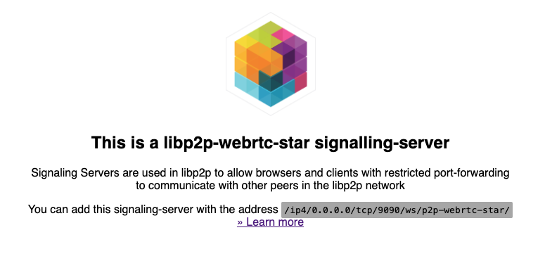

# libp2p WebRTC Star Signalling Server

## Build & Run

The ```libp2p/webrtc-star-signalling-server``` package can be implemented a few ways, depending on the level of control required.  Four options are provided below.

- A.) Recreate the Pre-Setup Image
- B.) Extend the Pre-Setup Image
- C.) Manual Setup - Image
- D.) Manual Setup - NodeJS

### A. Recreate the Pre-Setup Image

The following is a ```Dockerfile``` used to run the ```@libp2p/webrtc-star-signalling-server:latest``` package.

```Dockerfile
FROM node:lts-alpine as node

# Switch to the node user for installation
RUN npm install -g @libp2p/webrtc-star-signalling-server

# webrtc-star defaults to 9090
EXPOSE 9090

# Available overrides (defaults shown):
#   --port=9090 --host=0.0.0.0 --disableMetrics=false
# Server logging can be enabled via the DEBUG environment variable:
#   DEBUG=signalling-server,signalling-server:error
CMD [ "webrtc-star" ]
```

### B. Extend the Pre-Setup Image

This image uses the ```libp2p/js-libp2p-webrtc-star:latest``` image as a base.

```Dockerfile
FROM libp2p/js-libp2p-webrtc-star:latest

ENV DOMAIN "signal.ipfs.example.xyz"
ENV VIRTUAL_HOST "signal.ipfs.example.xyz"
ENV VIRTUAL_PORT "9090"

EXPOSE 9090
```

### C. Manual Setup - Image

Builds and runs the ```@libp2p/webrtc-star-signalling-server:latest``` package using the ```sigServer``` object declared in the ```src/index.ts``` file.

```sh
docker-compose up --build
```

### D. Manual Setup - NodeJS

Builds and runs the ```@libp2p/webrtc-star-signalling-server:latest``` package using the ```sigServer``` object declared in the ```src/index.ts``` file.

#### 1. Install the packages
```sh
npm install
```

#### 2. Build the package
```sh
npm run build
```

#### 3. Run the package
```sh
npm start
```

## Check the Server

The server can be checked by visiting the domain and port in a browser.

```sh
http://signal.ipfs.example.xyz:9090
```

[](./success.png)


## References

[1] Archived Libp2p WebRTC Star Signalling Server - [https://github.com/libp2p/js-libp2p-webrtc-star](https://github.com/libp2p/js-libp2p-webrtc-star)

[2] Archived Libp2p WebRTC Star Signalling Server Deployment Doc - [https://github.com/libp2p/js-libp2p-webrtc-star/blob/master/packages/webrtc-star-signalling-server/DEPLOYMENT.md](https://github.com/libp2p/js-libp2p-webrtc-star/blob/master/packages/webrtc-star-signalling-server/DEPLOYMENT.md)

[3] Libp2p WebRTC Star Signalling Server NPM - [https://www.npmjs.com/package/@libp2p/webrtc-star-signalling-server](https://www.npmjs.com/package/@libp2p/webrtc-star-signalling-server)